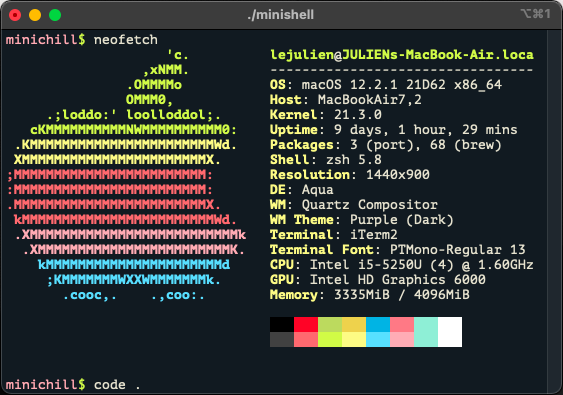

# minishell

un simple bash-like shell

COMPILING : make

RUNNING : ./minishell

<h1 align="center">Minishell</h1>
<h3 align="center">A little shell implementation</h3>

 - Little preview

<h6>  Installation :</h6>

make && ./minishell

- 🌱 Made at 42

